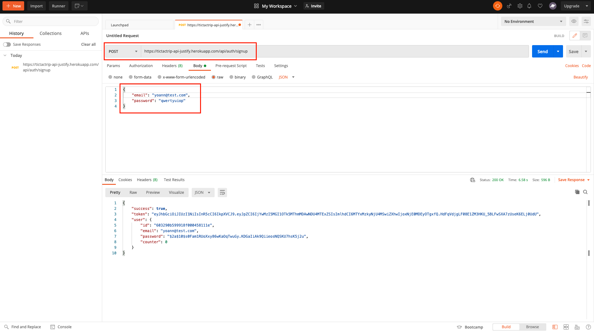
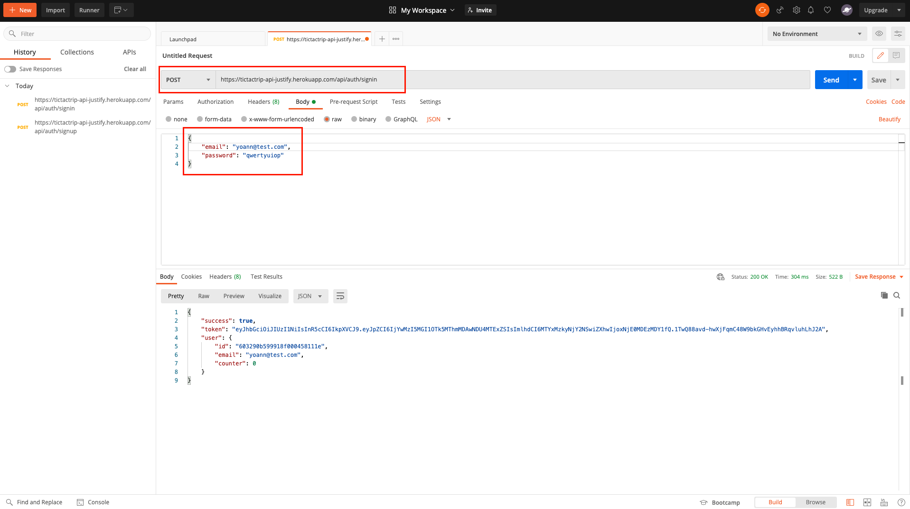
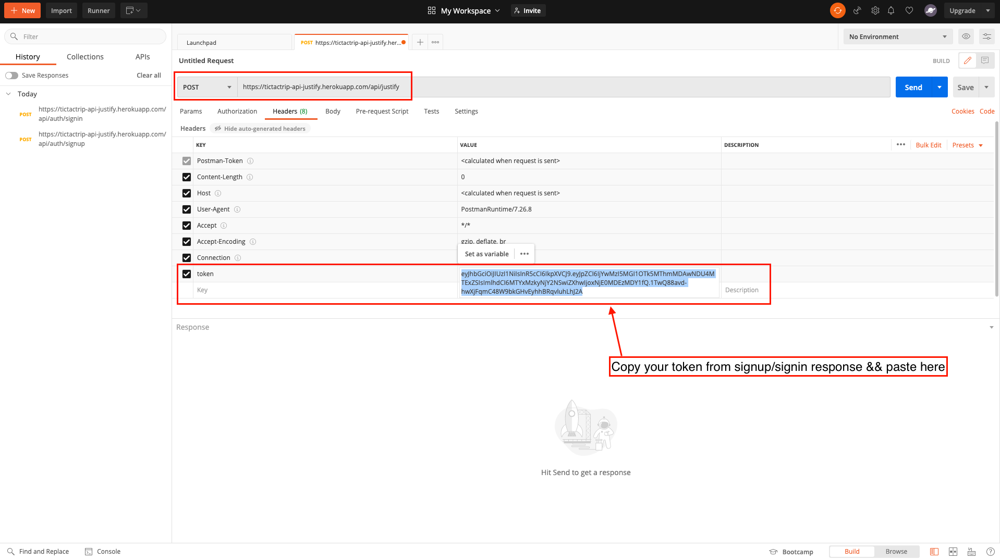
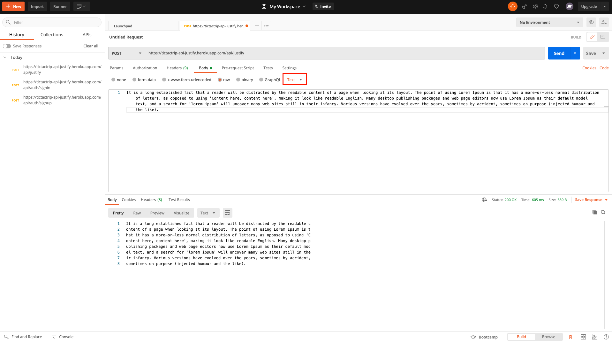

# REST API TO JUSTIFY A CONTENT
This project is a Node.js RESTFUL API using Node.JS/Express.JS and interacting with MongoDB as database.

## Stack
* Back : Node JS / Express JS
* DB : MongoDB
* Deployment : HEROKU
* Test : Mocha / Chai

## Project setup for local usage
### Configure MongoDB
The installation instructions can be found on [MongoDB Atlas documentation](https://docs.atlas.mongodb.com/getting-started/).

### Install dependencies
```
cd server
npm i or yarn install
```

### Setup your environment variables
Go to file `.env.example`

### Run server
```
npm run dev
```

The console should show :
```
Started on server port <your-port>
DB connected...
```

To quit nodemon : Ctrl + c.

## Project setup for remote usage (Heroku)
### Backend on Heroku
If you want to deploy on Heroku:
* Create an Heroku account (if you don't already have one)
* Click on New App
* Open your terminal and follow these steps:
```
$ heroku login
$ heroku git:clone -a <name-of-your-back-app>
$ cd server
$ git add . (BE CAREFUL DON'T PUSH your .env && node_modules folder)
$ git commit -am "First commit"
$ git push heroku master or git push heroku main
```

* Go to Heroku - dashboard > Settings > Config Vars and add your environment variables
```
JWT_SECRET
MONGO_URI
```

## Test
A test script can be found : `./test/tests.test.js`.

First run the server :

```
npm run dev
```

Then open a new terminal and run following commands :

```
cd test
npm test tests.test.js
```

OR

```
npm test test 
OR
npm test test/tests.test.js
```

## Presentation
RESTFUL API - taking unjustified plain/text content as an input && returning a plain/text content justified to 80 characters.
The /api/justify route is protected. You first have to authenticate with the /api/auth/signup or /api/auth/signin routes.

This route enables you to create an account. </br>
Request URL : https://tictactrip-api-justify.herokuapp.com/api/auth/signup || http://localhost:5000/api/auth/signup
</br>



</br>

This route enables you to login with your credentials. </br>
Request URL : https://tictactrip-api-justify.herokuapp.com/api/auth/signin || http://localhost:5000/api/auth/signin
</br>



</br>

This route enables you to justify an unjustify text.</br>
Request URL : https://tictactrip-api-justify.herokuapp.com/api/justify || http://localhost:5000/api/justify
</br>



</br>



